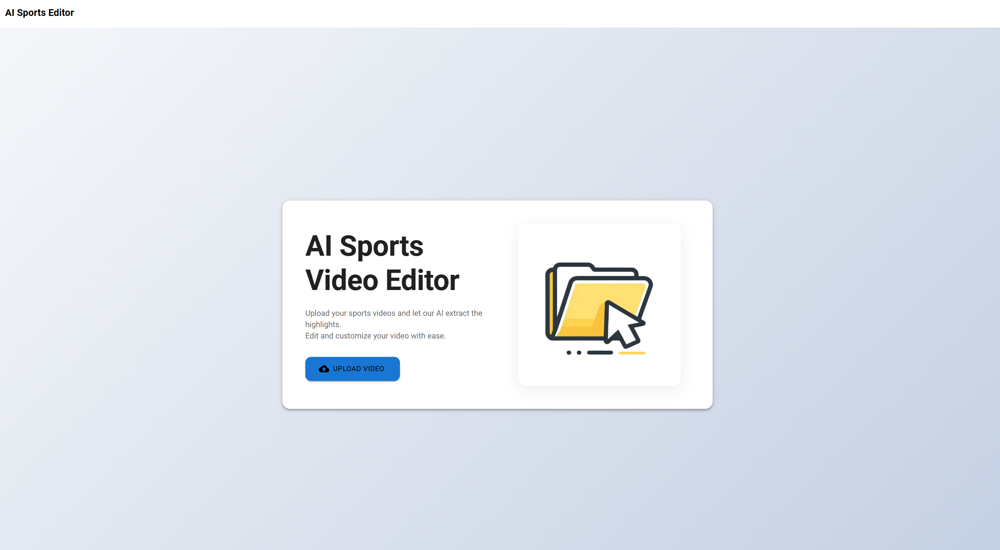
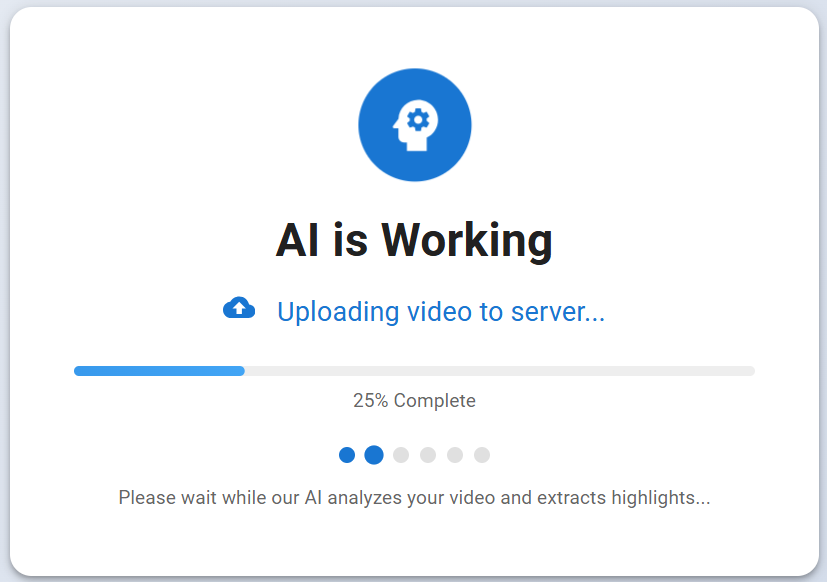
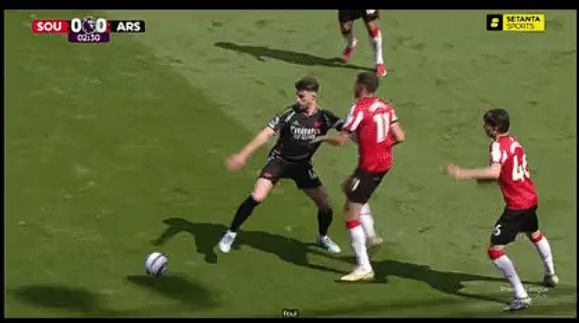

# ⚽ Playback - AI Sports Highlights Editor

> AI 기반 스포츠 하이라이트 자동 편집 웹 서비스

충북대학교 졸업작품으로 진행하는 Playback팀의 프로젝트입니다.


## 📖 프로젝트 소개

**Playback**은 스포츠(축구) 경기 영상에서 **AI를 활용해 하이라이트 장면을 자동으로 감지하고 편집**할 수 있는 웹 기반 서비스입니다.

영상 편집자와 콘텐츠 크리에이터들이 수 시간이 걸리는 하이라이트 편집 작업을 **몇 분 만에** 완료할 수 있도록 돕습니다.

### 🎯 주요 기능

- **🤖 AI 자동 하이라이트 감지**: 골, 슈팅, 세이브 등 주요 장면 자동 추출
- **✂️ 직관적인 타임라인 편집**: 드래그 앤 드롭으로 간편한 구간 편집
- **🎬 커스터마이징**: 텍스트 오버레이, 장면 전환 효과 추가
- **💾 빠른 내보내기**: 편집된 하이라이트 영상 즉시 다운로드
- **🎤 자동 자막 생성**: AI 음성 인식을 통한 자막 생성

## 📸 실행 화면

### 메인 페이지


### 비디오 업로드


### AI 추론


### 결과물


## 🛠️ 기술 스택

### Frontend
- **React** 17 - UI 프레임워크
- **Material-UI** - 디자인 시스템
- **Axios** - HTTP 클라이언트
- **React Router** - 페이지 라우팅
- **FFmpeg.wasm** - 클라이언트 사이드 비디오 처리

### Backend (별도 레포지토리)
- **Django** + **DRF** - REST API 서버
- **OpenCV** - 영상 처리 및 로고 탐지
- **Whisper** - AI 음성 인식 (자막 생성)
- **PyTorch** - 딥러닝 모델

## 🚀 시작하기

### 사전 요구사항
```bash
Node.js 14.x 이상
npm 6.x 이상
```

### 설치 및 실행

```bash
# 저장소 클론
git clone https://github.com/CBNU-playback/playback.git
cd playback

# 의존성 설치
npm install

# 개발 서버 실행
npm start
```

브라우저에서 [http://localhost:3000](http://localhost:3000) 접속

### 백엔드 연결

백엔드 서버가 필요합니다. [playback-BE](https://github.com/CBNU-playback/playback-BE) 레포지토리를 참고하세요.

```bash
# 백엔드 기본 주소
http://localhost:8000
```

## 💡 사용 방법

### 1️⃣ 비디오 업로드
- 메인 페이지에서 **"비디오 업로드"** 버튼 클릭
- 축구 경기 영상 파일 선택 (mp4, mkv, avi 등)
- 업로드 완료 대기

### 2️⃣ AI 하이라이트 자동 감지
- 업로드 완료 후 자동으로 AI 분석 시작
- 골, 슈팅, 코너킥 등 주요 장면 자동 감지
- 타임라인에 하이라이트 구간 표시

### 3️⃣ 하이라이트 편집
- 타임라인에서 구간 선택/수정
- 불필요한 구간 삭제
- 커스텀 구간 추가
- 텍스트 오버레이 설정
- 장면 전환 효과 선택

### 4️⃣ 내보내기
- **"하이라이트 내보내기"** 버튼 클릭
- 편집된 영상 다운로드

## 👥 팀 구성

| 이름 | 역할 | GitHub |
|------|------|--------|
| 배기원(중도 휴학) | 팀장, AI 개발, 프로젝트 관리 |
| 김동원 | 프론트엔드 개발, 미팅 관리 |
| 이동규 | 백엔드 개발, 자료 취합 |

## 🔗 관련 레포지토리

- **Backend API**: [playback-BE](https://github.com/CBNU-playback/playback-BE)

